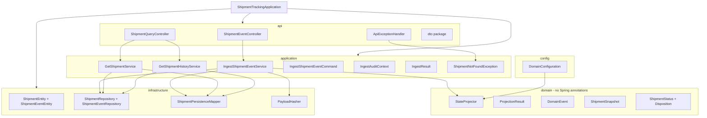
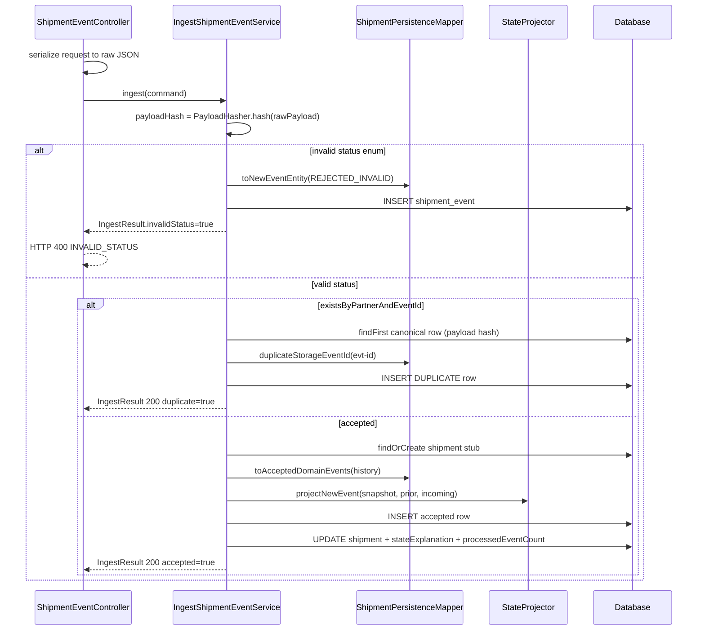
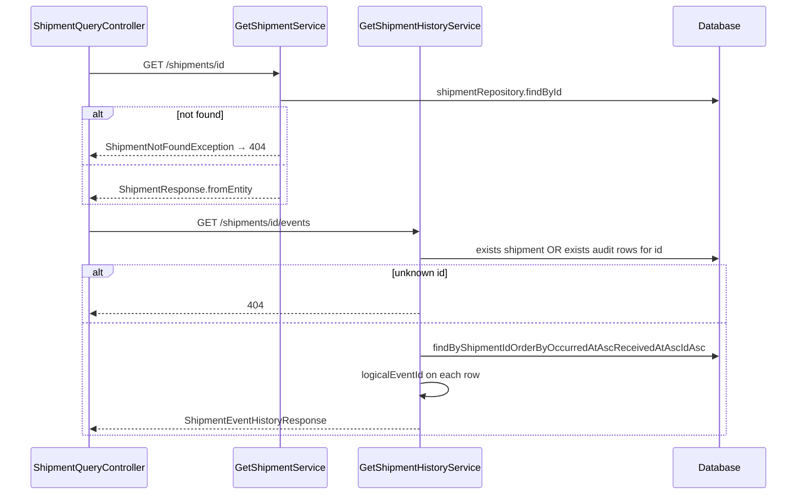
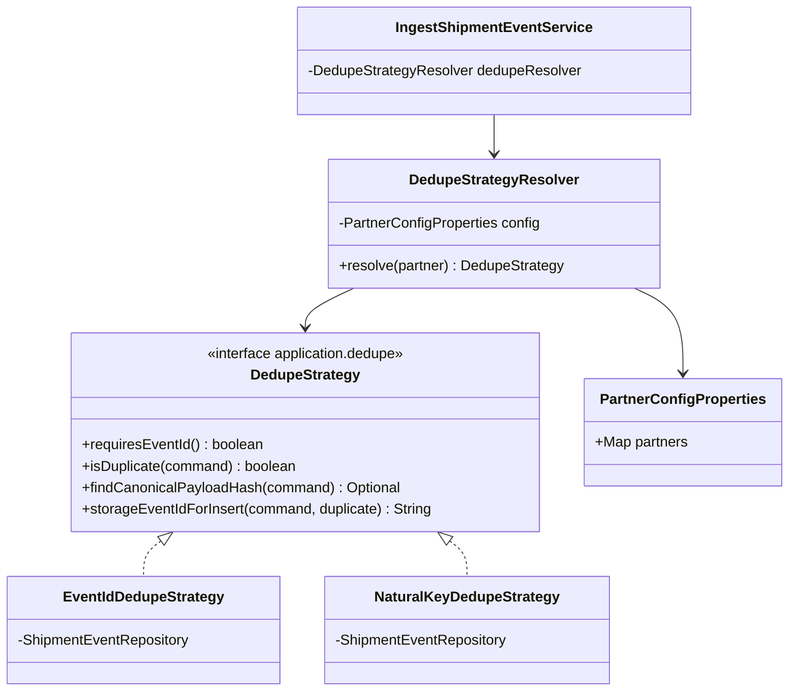
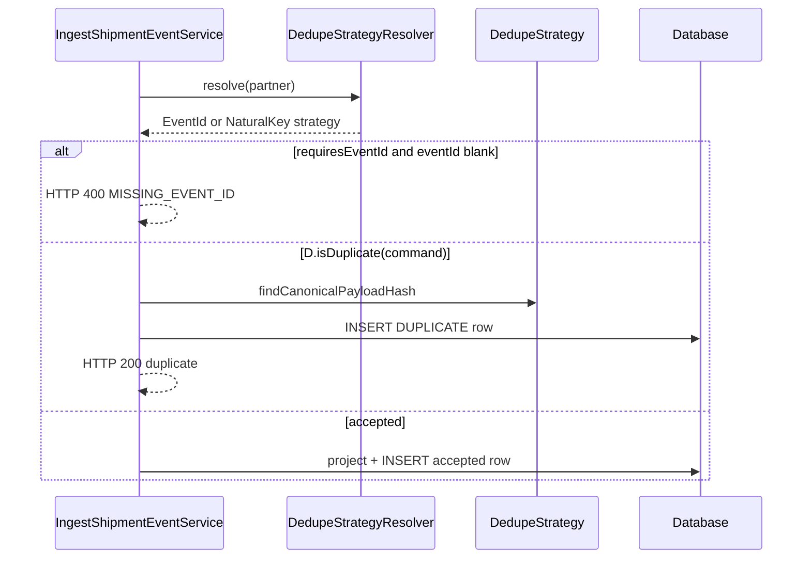

# Technical design — UML class diagram

**Source of truth with:** [`../ANALYSIS.md`](../ANALYSIS.md), [`DATABASE_ERD.md`](DATABASE_ERD.md)  
**Package:** `com.accso.shipment`  

**Commits:** Phase 1 classes in **Commit 1**. Phase 2 classes in **Commit 2** only.

**As-implemented:** Reconciled to match the codebase (Phase 1 + Phase 2) on 2026-05-19.

---

## Viewing diagrams

Diagrams use **Mermaid**. See [`README.md`](README.md).

---

## Phase overview

| Layer | Phase 1 (implemented) | Phase 2 (implemented) |
|-------|----------------------|------------------------|
| Dedupe | Inline in `IngestShipmentEventService` | `DedupeStrategy` + `DedupeStrategyResolver` + yaml — **logic in service, not DB UK for natural-key** (see § Dedupe enforcement) |
| Config | `DomainConfiguration` (`StateProjector` bean only) | `PartnerConfigProperties` |
| Validation | `eventId` required via service for event-id partners | Optional `eventId` for `acme`; `MISSING_EVENT_ID` if required and absent |
| Tests | `StateProjectorTest`, `ShipmentFlowIntegrationTest`, `ShipmentTrackingApplicationTests` | `ChangeRequestIntegrationTest` |

**Both phases:** `StateProjector`, three REST endpoints, JPA entities, `ShipmentPersistenceMapper`, domain records (`DomainEvent`, `ShipmentSnapshot`, `ProjectionResult`).

---

## Phase 1 — Architecture (as implemented)



---

## Phase 1 — Class diagram (as implemented)

```mermaid
classDiagram
    direction TB

    class ShipmentTrackingApplication {
        +main(args)$
    }

    class ShipmentEventController {
        +ingest(request) ResponseEntity
    }
    class ShipmentQueryController {
        +getShipment(shipmentId)
        +getHistory(shipmentId)
    }
    class ApiExceptionHandler {
        +handleNotFound()
        +handleValidation()
    }

    class IngestShipmentEventService {
        -StateProjector stateProjector
        -ShipmentRepository shipmentRepository
        -ShipmentEventRepository eventRepository
        -PayloadHasher payloadHasher
        -ShipmentPersistenceMapper mapper
        +ingest(command) IngestResult
    }
    class GetShipmentService {
        +getById(shipmentId) ShipmentResponse
    }
    class GetShipmentHistoryService {
        +getEvents(shipmentId) ShipmentEventHistoryResponse
    }
    class IngestShipmentEventCommand {
        <<record>>
    }
    class IngestAuditContext {
        <<record>>
    }
    class IngestResult {
        <<record>>
    }
    class ShipmentNotFoundException {
        <<exception>>
    }

    class StateProjector {
        +projectFromAcceptedEvents(shipmentId, events) ProjectionResult
        +projectNewEvent(before, prior, incoming) ProjectionResult
        +buildExplanation(...) String
    }
    class ProjectionResult {
        <<record>>
        snapshot
        disposition
        stateChanged
        stateExplanation
    }
    class DomainEvent {
        <<record>>
    }
    class ShipmentSnapshot {
        <<record>>
    }
    class ShipmentStatus {
        <<enumeration>>
    }
    class Disposition {
        <<enumeration>>
    }

    class ShipmentPersistenceMapper {
        +toDomainEvent(entity) DomainEvent
        +toAcceptedDomainEvents(entities) List
        +toSnapshot(entity) ShipmentSnapshot
        +applySnapshot(entity, snapshot, explanation, count)
        +toNewEventEntity(command, ...) ShipmentEventEntity
        +logicalEventId(storedId)$ String
        +duplicateStorageEventId(partnerEventId)$ String
    }
    class ShipmentEntity
    class ShipmentEventEntity
    class ShipmentRepository {
        <<interface>>
    }
    class ShipmentEventRepository {
        <<interface>>
        +findByShipmentIdOrderByOccurredAtAscReceivedAtAscIdAsc(id)
        +existsByPartnerAndEventId(partner, eventId)
        +findFirstByPartnerAndEventIdOrderByIdAsc(partner, eventId)
        +countByShipmentIdAndDispositionIn(shipmentId, dispositions)
        +existsByShipmentId(shipmentId)
    }
    class PayloadHasher {
        +hash(rawPayload) String
    }
    class DomainConfiguration {
        +stateProjector() StateProjector
    }

    class IngestShipmentEventRequest
    class IngestShipmentEventResponse {
        +forAccepted(command, projection)$
        +forDuplicate(command, mismatch, status)$
    }
    class ShipmentResponse {
        +fromEntity(entity)$ ShipmentResponse
    }
    class ShipmentEventItem
    class ErrorResponse

    ShipmentEventController --> IngestShipmentEventService
    ShipmentQueryController --> GetShipmentService
    ShipmentQueryController --> GetShipmentHistoryService
    IngestShipmentEventService --> StateProjector
    IngestShipmentEventService --> ShipmentRepository
    IngestShipmentEventService --> ShipmentEventRepository
    IngestShipmentEventService --> PayloadHasher
    IngestShipmentEventService --> ShipmentPersistenceMapper
    GetShipmentService --> ShipmentRepository
    GetShipmentHistoryService --> ShipmentRepository
    GetShipmentHistoryService --> ShipmentEventRepository
    DomainConfiguration ..> StateProjector : @Bean
    StateProjector ..> ShipmentStatus
    StateProjector ..> Disposition
    StateProjector ..> ProjectionResult
    ShipmentPersistenceMapper ..> DomainEvent
    ShipmentPersistenceMapper ..> ShipmentSnapshot
    ShipmentRepository ..> ShipmentEntity
    ShipmentEventRepository ..> ShipmentEventEntity
```



### Phase 1 — ingest sequence (as implemented)



**Note:** Duplicate detection is **proactive** (`existsByPartnerAndEventId`), not only via UK violation. The UK still applies; duplicate rows use a synthetic `event_id` (`partnerEventId + "::dup::" + nanoTime`) so the audit row can be stored (ADR 002).

### Phase 1 — read paths (as implemented)



---

## Phase 1 — package tree (as implemented)

```
com.accso.shipment/
├── ShipmentTrackingApplication.java
├── api/
│   ├── ShipmentEventController.java
│   ├── ShipmentQueryController.java
│   ├── dto/
│   │   ├── IngestShipmentEventRequest.java
│   │   ├── IngestShipmentEventResponse.java
│   │   ├── ShipmentResponse.java
│   │   ├── ShipmentEventItem.java
│   │   ├── ShipmentEventHistoryResponse.java
│   │   └── ErrorResponse.java
│   └── exception/ApiExceptionHandler.java
├── application/
│   ├── IngestShipmentEventService.java
│   ├── GetShipmentService.java
│   ├── GetShipmentHistoryService.java
│   ├── IngestAuditContext.java
│   ├── ShipmentNotFoundException.java
│   ├── command/IngestShipmentEventCommand.java
│   └── result/IngestResult.java
├── config/
│   └── DomainConfiguration.java          # @Bean StateProjector (domain stays Spring-free)
├── domain/
│   ├── model/
│   │   ├── ShipmentStatus.java
│   │   ├── Disposition.java
│   │   ├── DomainEvent.java
│   │   └── ShipmentSnapshot.java
│   └── projection/
│       ├── StateProjector.java
│       └── ProjectionResult.java
└── infrastructure/
    ├── persistence/
    │   ├── entity/ShipmentEntity.java, ShipmentEventEntity.java
    │   ├── repository/ShipmentRepository.java, ShipmentEventRepository.java
    │   └── mapper/ShipmentPersistenceMapper.java
    └── util/PayloadHasher.java
```

**Phase 1 (Commit 1) did not contain:** strategy pattern — dedupe was inline until Phase 2 refactor.

**Phase 2 package additions:**

```
application/dedupe/DedupeStrategy.java
infrastructure/dedupe/EventIdDedupeStrategy.java
infrastructure/dedupe/NaturalKeyDedupeStrategy.java
infrastructure/dedupe/DedupeStrategyResolver.java
infrastructure/config/PartnerConfigProperties.java
```

---

## Phase 2 — As implemented (Commit 2)



| Class | Package | Role |
|-------|---------|------|
| `DedupeStrategy` | `application.dedupe` | Partner-specific duplicate rules (application layer, not a DB constraint) |
| `EventIdDedupeStrategy` | `infrastructure.dedupe` | `dhl`: proactive exists + `uk_partner_event_id` backstop |
| `NaturalKeyDedupeStrategy` | `infrastructure.dedupe` | `acme`: natural-key exists in service only |
| `DedupeStrategyResolver` | `infrastructure.dedupe` | Yaml `shipment.partners.*.dedupe-strategy` |

### Phase 2 — ingest sequence (per-partner dedupe)



---

## Dedupe enforcement — why strategies live in the service

**Problem:** Multiple couriers, multiple duplicate definitions, **one** `shipment_event` table. A single database unique constraint cannot express per-partner rules without blocking `DUPLICATE` audit rows (see Phase 2 step 12 / UK `23505`).

**Rejected for simplicity:** separate table per courier; relying only on DB constraints for natural-key partners.

**Resolution:** `DedupeStrategy` + yaml config; `uk_partner_event_id` only for event-id partners; natural-key dedupe in `NaturalKeyDedupeStrategy`; Liquibase `004` drops `uk_partner_natural_key`. Details: [`../ANALYSIS.md`](../ANALYSIS.md) §6.4, [`DATABASE_ERD.md`](DATABASE_ERD.md) § Dedupe enforcement.

---

## Shared — StateProjector (Phase 1 and 2)

| Rule | Implementation |
|------|----------------|
| Order | `occurredAt` → `receivedAt` → `id` |
| Replay | `projectFromAcceptedEvents` rebuilds timeline; `projectNewEvent` compares to prior snapshot for `stateChanged` on ingest |
| Forward-only | Ordinal rank on `ShipmentStatus` |
| RETURNED | After `latestDeliveredAt`, strictly later `occurredAt` |
| Same instant | `DELIVERY_EXCEPTION` wins; still records delivery instant for RETURNED rule |
| Explanation | `buildExplanation` templates; persisted on `shipment.state_explanation` |

---

## Tests by phase (as implemented / planned)

| Test class | Phase | Role |
|------------|-------|------|
| `StateProjectorTest` | 1 | Domain rules unit tests |
| `ShipmentFlowIntegrationTest` | 1 | Walkthrough steps 1–10 (`step01_` … `step10b_`) |
| `ShipmentTrackingApplicationTests` | 1 | Context + `main` via `useMainMethod=ALWAYS` |
| `ChangeRequestIntegrationTest` | **2** | Walkthrough steps 11–12, 16; 3 tests total |

---

## Alignment checklist (vs implementation)

| Area | Design doc (this file) | Code |
|------|------------------------|------|
| Phase 1 dedupe | Inline in `IngestShipmentEventService` | ✓ (refactored in Phase 2) |
| Phase 2 dedupe | `DedupeStrategy` + resolver + yaml | ✓ `application.dedupe` + `infrastructure.dedupe` |
| Natural-key not in DB UK | Documented § Dedupe enforcement | ✓ `004` drops UK; `NaturalKeyDedupeStrategy` |
| `StateProjector` methods | `projectNewEvent`, `projectFromAcceptedEvents`, `buildExplanation` | ✓ |
| Mapper | `ShipmentPersistenceMapper` | ✓ |
| Domain wiring | `DomainConfiguration` @Bean | ✓ No `@Component` on `StateProjector` |
| Invalid ingest | `IngestResult` → controller → HTTP 400 | ✓ |
| Missing eventId | `MISSING_EVENT_ID` for event-id partners | ✓ |
| History 404 | `shipment` OR `shipment_event` exists | ✓ `GetShipmentHistoryService` |
| Duplicate storage | `duplicateStorageEventId` / `logicalEventId` | ✓ |

---

*Phase 1 and Phase 2 structure match implementation. Dedupe uniqueness is partner-specific application logic by design.*

---

## Implementation reconciliation (deltas from initial design)

Phase 1 diagrams above describe **Commit 1** structure; the **current codebase** includes Phase 2 (resolver + strategies). Original class lists are unchanged; this table adds **as-built** deltas.

| # | Initial UML / checklist | As implemented | How we picked it up |
|---|-------------------------|----------------|---------------------|
| 1 | Phase 1 ingest sequence: inline `existsByPartnerAndEventId` only | **`IngestShipmentEventService`** always uses **`DedupeStrategyResolver`** (Phase 2 refactor) | Post–Phase 2 code read; Phase 1 sequence kept as historical |
| 2 | Phase 2 diagram: `MISSING_EVENT_ID` from service → HTTP 400 | Service returns **`IngestResult.forMissingEventId()`**; **`ShipmentEventController`** maps to 400 | Reading `IngestShipmentEventService` + controller |
| 3 | `DedupeStrategy` on domain layer (early drafts) | Interface: **`application.dedupe`**; impls: **`infrastructure.dedupe`** | Package tree refactor |
| 4 | `PartnerConfigProperties` only | Also **`PartnerConfiguration`** (`@EnableConfigurationProperties`) | `infrastructure/config/` |
| 5 | `ShipmentEventRepository` Phase 1 methods only | **Added:** `existsByPartnerAndShipmentIdAndStatusAndOccurredAtAndDispositionIsNot`, `findFirst…AndDispositionIsNotOrderByIdAsc` | `NaturalKeyDedupeStrategy` |
| 6 | `IngestResult` = response + `invalidStatus` | **Added:** `missingEventId` flag (Phase 2) | Controller + `IngestResult.java` |
| 7 | `duplicateStorageEventId(partnerEventId)` only | **`NaturalKeyDedupeStrategy`** uses **`naturalKeyToken(command)`** + same `::dup::` suffix helper | History API shows `nk::acme::…` on duplicate rows |
| 8 | `DedupeStrategy.constraintName()` (planned Phase 2 sketch) | **Not implemented** — interface has `requiresEventId`, `isDuplicate`, `findCanonicalPayloadHash`, `storageEventIdForInsert` | Replaced during implementation (DB UK not universal) |
| 9 | Tests table: `ChangeRequestIntegrationTest` steps 11–12 only | **Also:** `givenDhlPartner_whenPostWithoutEventId_then400`; walkthrough steps **13–16** are **manual** | Test class + walkthrough expansion |
| 10 | Phase 1 architecture diagram: no dedupe package | Current tree adds **`application/dedupe`**, **`infrastructure/dedupe`**, **`infrastructure/config`** | `src/main/java` listing |

**Unchanged vs design:** `StateProjector`, three controllers, `ShipmentPersistenceMapper`, `PayloadHasher`, `DomainConfiguration`, GET history 404 rule (`shipment` OR audit exists).

See also: [`../ANALYSIS.md`](../ANALYSIS.md) §14 · [`DATABASE_ERD.md`](DATABASE_ERD.md) § Implementation reconciliation.
