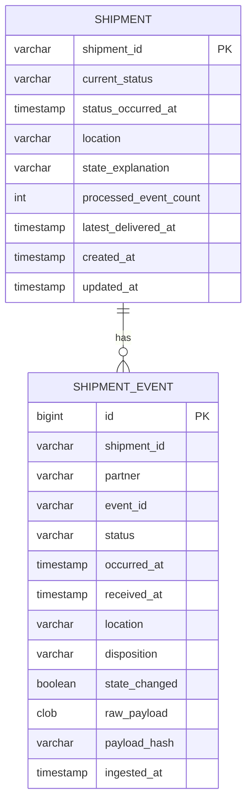
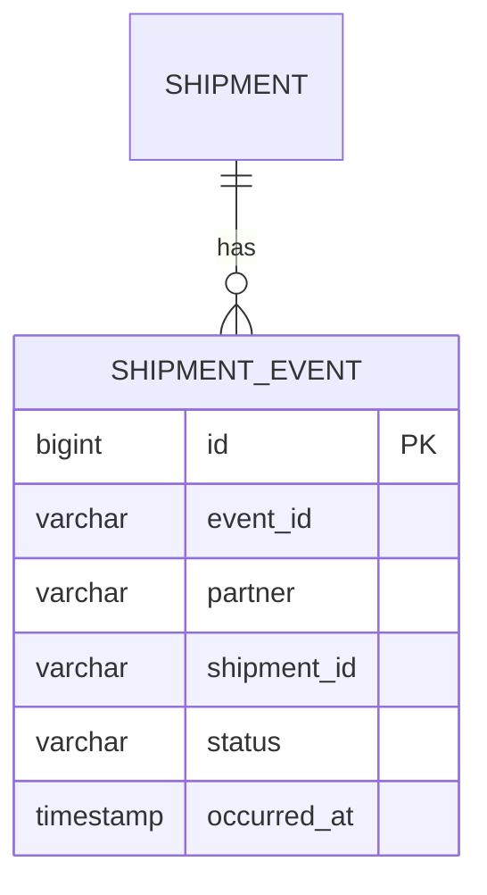
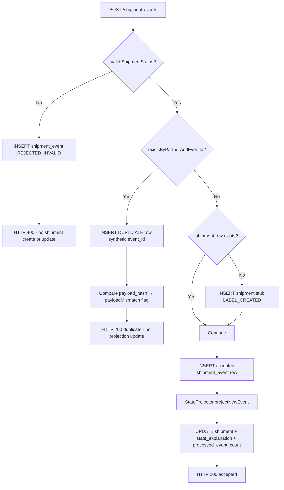

# Database design — ERD

**Source of truth with:** `[../ANALYSIS.md](../ANALYSIS.md)` (Phase 1 vs Phase 2)  
**DB:** H2 in-memory (assignment) · **Schema:** Liquibase  

**Commits:** Phase 1 schema in **Commit 1**. Phase 2 adds changelog `003` only in **Commit 2**.

**As-implemented (Phase 1):** Reconciled to match Liquibase `001`/`002` and JPA entities on 2026-05-19.

---

## Viewing diagrams

Diagrams use **Mermaid**. See `[README.md](README.md)` for how to view them.

---

## Phase overview


|                       | Phase 1 (implemented)                   | Phase 2 (planned — Commit 2)                    |
| --------------------- | --------------------------------------- | ----------------------------------------------- |
| **Dedupe**            | `(partner, event_id)` — probe + UK      | + `(partner, shipment_id, status, occurred_at)` |
| `**event_id` column** | NOT NULL                                | Nullable (natural-key partners)                 |
| **Liquibase**         | `001`, `002`                            | + `003`                                         |
| **Duplicate rows**    | Synthetic `event_id` (`::dup::` suffix) | Same pattern                                    |


**Shared in both phases:** `shipment` + `shipment_event`, disposition column, full `raw_payload`, projection columns on `shipment`.

---

## Phase 1 — ERD (as implemented)




Column nullability, lengths, and Phase 1 `event_id` rules are in the table definitions below (Mermaid erDiagram does not reliably render quoted comments or types such as `clob` / `boolean`).

**Logical relationship:** `shipment_event.shipment_id` → `shipment.shipment_id` (no DB foreign-key constraint in Phase 1; enforced in application).

### Phase 1 — constraints (Liquibase 002)


| Name                          | Type        | Columns                                       |
| ----------------------------- | ----------- | --------------------------------------------- |
| `pk_shipment`                 | PRIMARY KEY | `shipment_id`                                 |
| `pk_shipment_event`           | PRIMARY KEY | `id`                                          |
| `**uk_partner_event_id`**     | **UNIQUE**  | `**(partner, event_id)`**                     |
| `idx_event_shipment_timeline` | INDEX       | `(shipment_id, occurred_at, received_at, id)` |


**Not in Phase 1:** `uk_partner_natural_key`, nullable `event_id`.

### Phase 1 — duplicate `event_id` storage (application)

The UK on `(partner, event_id)` prevents two audit rows with the same partner event id. On duplicate ingest the service still stores a **full audit row** using a synthetic key:

```text
stored event_id = {partnerEventId} + "::dup::" + {nanoTime}
```

API responses and GET history expose the **logical** id (strip `::dup::…`) via `ShipmentPersistenceMapper.logicalEventId()`. See ADR 002.

### Phase 1 — Liquibase files (as implemented)

```
db/changelog/
├── db.changelog-master.yaml
├── 001-create-shipment.yaml
└── 002-create-shipment-event.yaml
```

---

## Phase 2 — Planned changes (Commit 2)




Phase 2 adds `uk_partner_natural_key` on `(partner, shipment_id, status, occurred_at)`; `uk_partner_event_id` unchanged; `event_id` becomes nullable for natural-key partners.


| Change                       | Detail                                                   |
| ---------------------------- | -------------------------------------------------------- |
| `event_id`                   | Alter to **nullable**                                    |
| `**uk_partner_natural_key`** | **UNIQUE** `(partner, shipment_id, status, occurred_at)` |
| Dedupe logic                 | `DedupeStrategyResolver` by partner config               |


```
└── 003-phase2-natural-key.yaml
```

`**shipment` table:** no Phase 2 column changes.

---

## Table definitions — Phase 1 (matches entities + Liquibase)

### `shipment`


| Column                      | Type (H2/Liquibase)                 | Purpose                                           |
| --------------------------- | ----------------------------------- | ------------------------------------------------- |
| `shipment_id`               | `varchar(64)` PK                    | Business id                                       |
| `current_status`            | `varchar(32)`                       | Projected status                                  |
| `status_occurred_at`        | `timestamp with time zone`          | Status effective time                             |
| `location`                  | `varchar(255)` nullable             | From winning event                                |
| `state_explanation`         | `varchar(1024)`                     | `StateProjector.buildExplanation()` at write time |
| `processed_event_count`     | `int`                               | Excludes `DUPLICATE`, `REJECTED_INVALID`          |
| `latest_delivered_at`       | `timestamp with time zone` nullable | RETURNED-after-delivery rule                      |
| `created_at` / `updated_at` | `timestamp with time zone`          | Metadata                                          |


**Created when:** first **accepted** ingest calls `findOrCreateShipment` (stub with `LABEL_CREATED`). **Not** created on invalid-only ingest (§7.4).

### `shipment_event`

| Column | Type | Purpose |
|--------|---------|
| `id` | `bigint` identity PK | Surrogate key |
| `shipment_id` | `varchar(64)` | Groups audit per shipment |
| `partner` | `varchar(64)` | Courier code |
| `event_id` | `varchar(128)` NOT NULL | Dedupe key with `partner`; synthetic value for `DUPLICATE` rows |
| `status` | `varchar(32)` | Raw status string from payload |
| `occurred_at` / `received_at` | timestamptz | Business time vs ingest time |
| `location` | `varchar(255)` nullable | Optional |
| `disposition` | `varchar(32)` | `ACCEPTED`*, `DUPLICATE`, `REJECTED_INVALID` |
| `state_changed` | `boolean` | Whether row changed projected state |
| `raw_payload` | `clob` | Full request JSON |
| `payload_hash` | `varchar(64)` | SHA-256 hex for mismatch detection |
| `ingested_at` | timestamptz | Server ingest timestamp |

Every POST → one row (including invalid and duplicate attempts).

---

## Ingest flow — Phase 1 (as implemented)




| Path              | `shipment` table                                                | `shipment_event`                       |
| ----------------- | --------------------------------------------------------------- | -------------------------------------- |
| Invalid status    | No create/update (may already exist from prior accepted events) | `REJECTED_INVALID` row                 |
| Duplicate         | No update                                                       | `DUPLICATE` row + synthetic `event_id` |
| Accepted (new id) | Create stub if missing, then update                             | Accepted disposition row               |


**Phase 1 dedupe key:** `(partner, event_id)` only — checked with `existsByPartnerAndEventId` before insert.

---

## Disposition column (both phases)


| Disposition                | Updates `shipment`?           | In `processed_event_count`? |
| -------------------------- | ----------------------------- | --------------------------- |
| `ACCEPTED`                 | If first status / rules apply | Yes                         |
| `ACCEPTED_STATE_CHANGED`   | Yes                           | Yes                         |
| `ACCEPTED_NO_STATE_CHANGE` | No                            | Yes                         |
| `DUPLICATE`                | No                            | No                          |
| `REJECTED_INVALID`         | No                            | No                          |


---

## Read paths — Phase 1 (as implemented)


| API                          | Tables           | Behaviour                                                                                                                                  |
| ---------------------------- | ---------------- | ------------------------------------------------------------------------------------------------------------------------------------------ |
| `GET /shipments/{id}`        | `shipment` only  | 404 if no `shipment` row (invalid-only shipment → 404)                                                                                     |
| `GET /shipments/{id}/events` | `shipment_event` | 404 only if **neither** `shipment` nor any `shipment_event` for id; returns all dispositions; order `occurred_at`, `received_at`, `id` ASC |


Repository: `ShipmentEventRepository.findByShipmentIdOrderByOccurredAtAscReceivedAtAscIdAsc`.

---

## Dedupe by phase (summary)


| Partner | Phase 1 (implemented)           | Phase 2 (planned)                             |
| ------- | ------------------------------- | --------------------------------------------- |
| `dhl`   | `(partner, event_id)`           | Same                                          |
| `acme`  | Not supported (needs `eventId`) | `(partner, shipment_id, status, occurred_at)` |


---

## Implementation ↔ schema checklist


| Item                            | ERD / Liquibase | Code                               |
| ------------------------------- | --------------- | ---------------------------------- |
| Column set on `shipment`        | 9 columns       | `ShipmentEntity` ✓                 |
| Column set on `shipment_event`  | 14 columns      | `ShipmentEventEntity` ✓            |
| UK `uk_partner_event_id`        | 002             | `existsByPartnerAndEventId` + UK ✓ |
| Timeline index                  | 002             | Repository method name matches ✓   |
| No FK shipment_event → shipment | —               | Application-only link ✓            |
| Changelog `003`                 | Phase 2 only    | Not present ✓                      |


---

*Phase 1 schema matches implementation. Phase 2 section is unchanged planned work for Commit 2.*