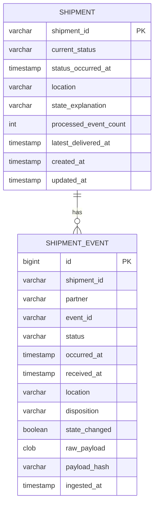
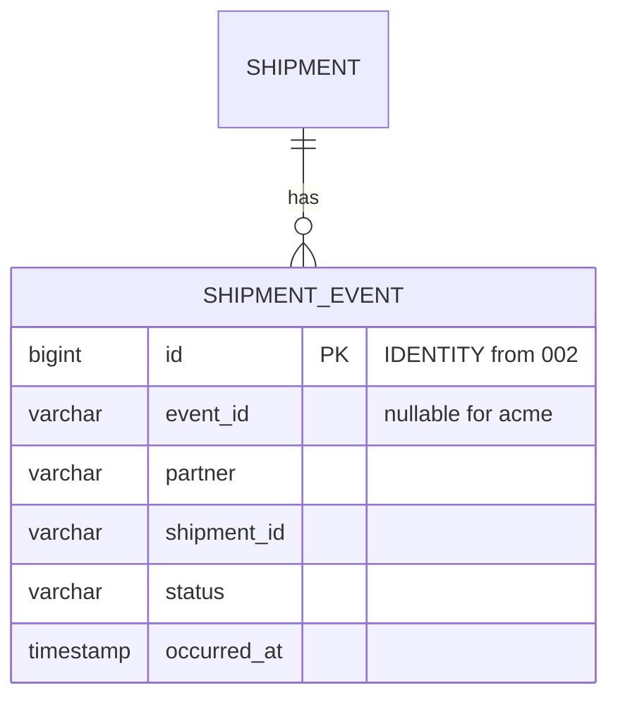
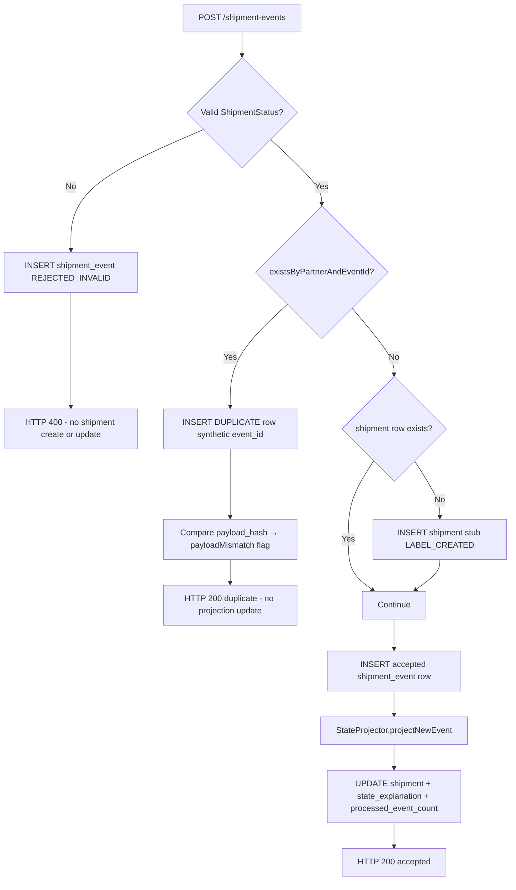

# Database design — ERD

**Source of truth with:** `[../ANALYSIS.md](../ANALYSIS.md)` (Phase 1 vs Phase 2)  
**DB:** H2 in-memory (PoC) · **Schema:** Liquibase  

**Commits:** Phase 1 schema in **Commit 1**. Phase 2 adds changelogs `003`–`004` in **Commit 2**.

**As-implemented:** Reconciled to match Liquibase and JPA entities (Phase 1 + Phase 2 dedupe decision documented in § Dedupe enforcement).

---

## Viewing diagrams

Diagrams use **Mermaid**. See `[README.md](README.md)` for how to view them.

---

## Phase overview


|                       | Phase 1 (implemented)                   | Phase 2 (implemented)                                      |
| --------------------- | --------------------------------------- | ---------------------------------------------------------- |
| **Dedupe**            | `(partner, event_id)` — service + UK    | Per-partner: event-id UK **or** natural-key **in service** |
| **`event_id` column** | NOT NULL                                | Nullable (natural-key partners)                            |
| **Liquibase**         | `001`, `002` (`id` BIGINT auto-increment PK) | + `003` (nullable `event_id`), `004` (drop natural-key UK; **no change to `id`**) |
| **`shipment_event.id`** | `bigint` IDENTITY PK (002)              | Unchanged — still auto-increment; app never assigns |
| **Duplicate rows**    | Synthetic `event_id` (`::dup::` suffix) | Same for event-id; natural-key uses synthetic `event_id` on duplicate rows |


**Shared in both phases:** `shipment` + `shipment_event`, disposition column, full `raw_payload`, projection columns on `shipment`.

---

## Phase 1 — ERD (as implemented)




Column nullability, lengths, and Phase 1 `event_id` rules are in the table definitions below (Mermaid erDiagram does not reliably render quoted comments or types such as `clob` / `boolean`).

**Logical relationship:** `shipment_event.shipment_id` → `shipment.shipment_id` (no DB foreign-key constraint in Phase 1; enforced in application).

### Phase 1 — constraints (Liquibase 002)


| Name                          | Type        | Columns                                       |
| ----------------------------- | ----------- | --------------------------------------------- |
| `pk_shipment`                 | PRIMARY KEY | `shipment_id`                                 |
| `pk_shipment_event`           | PRIMARY KEY | `id` (BIGINT **auto-increment** / IDENTITY)   |
| `**uk_partner_event_id`**     | **UNIQUE**  | `**(partner, event_id)`**                     |
| `idx_event_shipment_timeline` | INDEX       | `(shipment_id, occurred_at, received_at, id)` |


**Not in Phase 1:** `uk_partner_natural_key`, nullable `event_id`.

### Phase 1 — duplicate `event_id` storage (application)

The UK on `(partner, event_id)` prevents two audit rows with the same partner event id. On duplicate ingest the service still stores a **full audit row** using a synthetic key:

```text
stored event_id = {partnerEventId} + "::dup::" + {nanoTime}
```

API responses and GET history expose the **logical** id (strip `::dup::…`) via `ShipmentPersistenceMapper.logicalEventId()`. See ADR 002.

### Phase 1 — Liquibase files (as implemented)

```
db/changelog/
├── db.changelog-master.yaml
├── 001-create-shipment.yaml
└── 002-create-shipment-event.yaml
```

---

## Phase 2 — Schema changes (Commit 2)



| Changelog | Change |
|-----------|--------|
| `003-phase2-natural-key.yaml` | `event_id` **nullable** (was paired with experimental `uk_partner_natural_key`) |
| `004-natural-key-partial-index.yaml` | **Drop** `uk_partner_natural_key` — see § Dedupe enforcement below |

**`shipment_event.id` (not in 003/004):** The Phase 2 ERD still shows `bigint id PK` because every audit row needs a stable surrogate key for timeline ordering and tie-breaks. That column is created in **`002-create-shipment-event.yaml`** with `type: bigint` and `autoIncrement: true` (H2 **IDENTITY**). Phase 2 changelogs do **not** recreate or alter `id` — only dedupe-related columns/constraints change. JPA: `@GeneratedValue(strategy = GenerationType.IDENTITY)` on `ShipmentEventEntity` — the application never sets `id` on insert.

**`shipment` table:** no Phase 2 column changes.

```
db/changelog/
├── 001-create-shipment.yaml
├── 002-create-shipment-event.yaml
├── 003-phase2-natural-key.yaml
└── 004-natural-key-partial-index.yaml
```

---

## Dedupe enforcement — one table, multiple partner rules

**Issue (found during Phase 2 implementation):** Several couriers share `shipment_event`, but each can use a **different** definition of “duplicate”. A single database unique constraint cannot express all of them without blocking legitimate audit rows.

| Scenario | Why a global UK fails |
|----------|------------------------|
| Natural-key partner (`acme`) | Duplicate = same `(partner, shipment_id, status, occurred_at)` with a **new** `receivedAt`. We must **insert** a second row with `disposition = DUPLICATE` and the **same** natural key as the accepted row. A full UK on those four columns rejects that insert (`23505` in step 12). |
| Event-id partner (`dhl`) | Duplicate = same `(partner, event_id)`. UK works **if** duplicate audit rows use a **synthetic** `event_id` (Phase 1 pattern). |
| Multiple strategies | A constraint useful for `acme` is wrong for `dhl` (and vice versa). |

**Alternatives considered:**

| Approach | Verdict |
|----------|---------|
| **Separate table per courier** | Clear per-partner constraints; rejected for this PoC — more schema, joins, and ops complexity. |
| **Partial unique index** (`WHERE disposition <> 'DUPLICATE'`) | Correct on PostgreSQL; **not supported on H2**, so not used for the PoC. |
| **Application-layer dedupe (chosen)** | `DedupeStrategy` + yaml partner config; proactive checks before insert; keep `uk_partner_event_id` only where it fits. |

**As-implemented constraints on `shipment_event`:**

| Constraint | Partners | Purpose |
|------------|----------|---------|
| `uk_partner_event_id` on `(partner, event_id)` | event-id (e.g. `dhl`) | Backstop for duplicate `eventId`; duplicate **audit** rows avoid collision via `::dup::` synthetic `event_id` |
| *(none)* on natural key columns | natural-key (e.g. `acme`) | Uniqueness of logical updates enforced in **`NaturalKeyDedupeStrategy`** (`exists…AndDispositionIsNot`) |

Cross-reference: [`../ANALYSIS.md`](../ANALYSIS.md) §6.4 · [`CLASS_DIAGRAM.md`](CLASS_DIAGRAM.md) § Phase 2.

---

## Table definitions — Phase 1 (matches entities + Liquibase)

### `shipment`


| Column                      | Type (H2/Liquibase)                 | Purpose                                           |
| --------------------------- | ----------------------------------- | ------------------------------------------------- |
| `shipment_id`               | `varchar(64)` PK                    | Business id                                       |
| `current_status`            | `varchar(32)`                       | Projected status                                  |
| `status_occurred_at`        | `timestamp with time zone`          | Status effective time                             |
| `location`                  | `varchar(255)` nullable             | From winning event                                |
| `state_explanation`         | `varchar(1024)`                     | `StateProjector.buildExplanation()` at write time |
| `processed_event_count`     | `int`                               | Excludes `DUPLICATE`, `REJECTED_INVALID`          |
| `latest_delivered_at`       | `timestamp with time zone` nullable | RETURNED-after-delivery rule                      |
| `created_at` / `updated_at` | `timestamp with time zone`          | Metadata                                          |


**Created when:** first **accepted** ingest calls `findOrCreateShipment` (stub with `LABEL_CREATED`). **Not** created on invalid-only ingest (§7.4).

### `shipment_event`

| Column | Type | Purpose |
|--------|---------|
| `id` | `bigint` **IDENTITY** PK (`002` `autoIncrement: true`) | Surrogate key; DB assigns on insert; used in history sort tie-break |
| `shipment_id` | `varchar(64)` | Groups audit per shipment |
| `partner` | `varchar(64)` | Courier code |
| `event_id` | `varchar(128)` nullable (Phase 2) | Required for event-id partners in API; null allowed for `acme`; synthetic value for `DUPLICATE` rows |
| `status` | `varchar(32)` | Raw status string from payload |
| `occurred_at` / `received_at` | timestamptz | Business time vs ingest time |
| `location` | `varchar(255)` nullable | Optional |
| `disposition` | `varchar(32)` | `ACCEPTED`*, `DUPLICATE`, `REJECTED_INVALID` |
| `state_changed` | `boolean` | Whether row changed projected state |
| `raw_payload` | `clob` | Full request JSON |
| `payload_hash` | `varchar(64)` | SHA-256 hex for mismatch detection |
| `ingested_at` | timestamptz | Server ingest timestamp |

Every POST → one row (including invalid and duplicate attempts).

---

## Ingest flow — Phase 1 (as implemented)




| Path              | `shipment` table                                                | `shipment_event`                       |
| ----------------- | --------------------------------------------------------------- | -------------------------------------- |
| Invalid status    | No create/update (may already exist from prior accepted events) | `REJECTED_INVALID` row                 |
| Duplicate         | No update                                                       | `DUPLICATE` row + synthetic `event_id` |
| Accepted (new id) | Create stub if missing, then update                             | Accepted disposition row               |


**Phase 1 dedupe key:** `(partner, event_id)` only — checked with `existsByPartnerAndEventId` before insert.

---

## Disposition column (both phases)


| Disposition                | Updates `shipment`?           | In `processed_event_count`? |
| -------------------------- | ----------------------------- | --------------------------- |
| `ACCEPTED`                 | If first status / rules apply | Yes                         |
| `ACCEPTED_STATE_CHANGED`   | Yes                           | Yes                         |
| `ACCEPTED_NO_STATE_CHANGE` | No                            | Yes                         |
| `DUPLICATE`                | No                            | No                          |
| `REJECTED_INVALID`         | No                            | No                          |


---

## Read paths — Phase 1 (as implemented)


| API                          | Tables           | Behaviour                                                                                                                                  |
| ---------------------------- | ---------------- | ------------------------------------------------------------------------------------------------------------------------------------------ |
| `GET /shipments/{id}`        | `shipment` only  | 404 if no `shipment` row (invalid-only shipment → 404)                                                                                     |
| `GET /shipments/{id}/events` | `shipment_event` | 404 only if **neither** `shipment` nor any `shipment_event` for id; returns all dispositions; order `occurred_at`, `received_at`, `id` ASC |


Repository: `ShipmentEventRepository.findByShipmentIdOrderByOccurredAtAscReceivedAtAscIdAsc`.

---

## Dedupe by partner (summary)


| Partner | Logical duplicate key | Enforced in |
| ------- | --------------------- | ----------- |
| `dhl`   | `(partner, event_id)` | Service (`EventIdDedupeStrategy`) + `uk_partner_event_id` |
| `acme`  | `(partner, shipment_id, status, occurred_at)` | Service only (`NaturalKeyDedupeStrategy`) |


---

## Implementation ↔ schema checklist


| Item                            | ERD / Liquibase | Code                               |
| ------------------------------- | --------------- | ---------------------------------- |
| Column set on `shipment`        | 9 columns       | `ShipmentEntity` ✓                 |
| Column set on `shipment_event`  | 14 columns      | `ShipmentEventEntity` ✓            |
| `id` BIGINT auto-increment      | `002`           | `GenerationType.IDENTITY` ✓        |
| UK `uk_partner_event_id`        | 002             | `EventIdDedupeStrategy` + synthetic dup `event_id` ✓ |
| No `uk_partner_natural_key`     | `004` drops UK  | `NaturalKeyDedupeStrategy` ✓       |
| Nullable `event_id`           | `003`           | `acme` ingest without `eventId` ✓  |
| Timeline index                  | 002             | Repository method name matches ✓   |
| No FK shipment_event → shipment | —               | Application-only link ✓            |


---

*Schema matches implementation. Natural-key dedupe is application-enforced by design (§ Dedupe enforcement).*

---

## Implementation reconciliation (deltas from initial design)

Earlier sections retain the **original** Phase 1 / Phase 2 design narrative. The table below records **as-built** schema behaviour discovered during implementation (nothing above is removed).

| # | Initial ERD / migration plan | As implemented | How we picked it up |
|---|------------------------------|----------------|---------------------|
| 1 | Phase 2: add **`uk_partner_natural_key`** on `(partner, shipment_id, status, occurred_at)` | **`003`** added UK; **`004`** **drops** it — running DB has **no** natural-key UK | `NaturalKeyDedupeIntegrationTest` step 12 — insert `DUPLICATE` row hit `23505` |
| 2 | Dedupe “in DB” for all partners (Phase overview) | **`uk_partner_event_id` only** (`002`); `acme` dedupe via repository `exists…` in service | Same test + [`../ANALYSIS.md`](../ANALYSIS.md) §6.4 |
| 3 | Duplicate audit `event_id` = `{logicalId}::dup::…` (Phase 1 text) | **`dhl`:** `{eventId}::dup::{nano}`. **`acme` duplicate:** `nk::{partner}::{shipmentId}::{status}::{occurredAt}::dup::{nano}`; **`acme` accepted:** `event_id` **NULL** | GET `/shipments/ship-acme-001/events` (walkthrough step 13) |
| 4 | Phase 2 ERD snippet implied `id` might change in `004` | **`id`** remains **`002`** BIGINT **auto-increment**; `004` only drops UK | Doc review vs Liquibase files (DEVELOPMENT_PROCESS audit) |
| 5 | Partial unique index `WHERE disposition <> 'DUPLICATE'` | **Not used** — H2 does not support; application dedupe only for natural-key | Attempted fix after row 1 failure; rejected in § Dedupe enforcement |

**Repository detail (not on ERD diagram):** natural-key duplicate detection uses `existsByPartnerAndShipmentIdAndStatusAndOccurredAtAndDispositionIsNot(…, 'DUPLICATE')` so only **non-duplicate** rows define “already accepted” for the same natural key.

See also: [`../ANALYSIS.md`](../ANALYSIS.md) §14 · [`CLASS_DIAGRAM.md`](CLASS_DIAGRAM.md) § Implementation reconciliation.